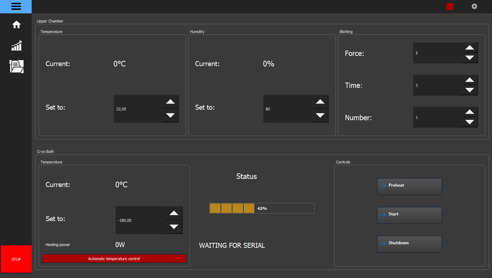
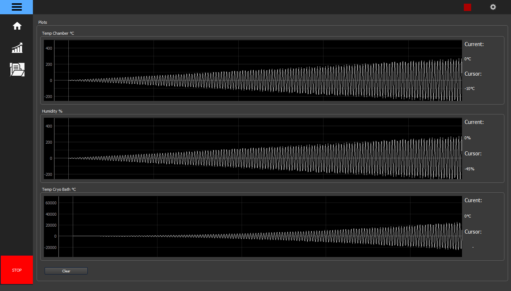
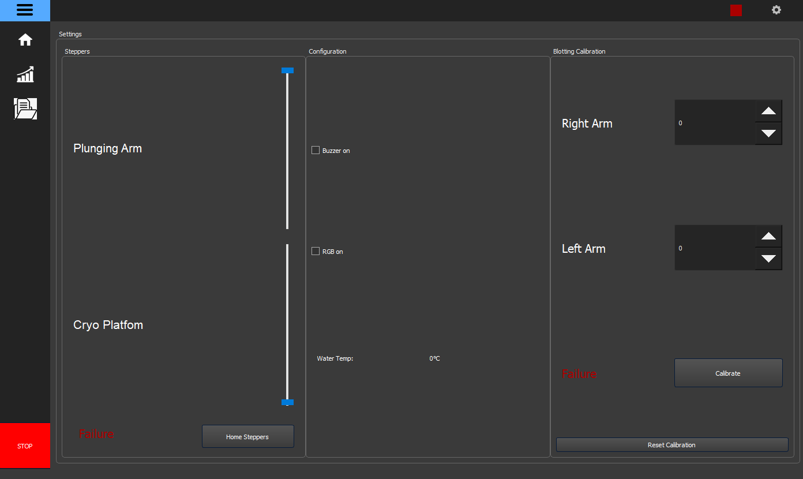

# Plunge Freezer GUI

## Description
In this Project, we created a so-called [Plunge Freezer](https://en.wikipedia.org/wiki/Cryofixation). This is a device to rapidly shock frost biological cells to inspect them under a microscope afterwards.
The shock frosting needs to be very fast to avoid the formation of ice crystals that destroy the probe.

This Repository contains the code for the PC gui to control the device. It was created using the Qt framework in Python. The gui is deigned around a dark theme and is designed to be intuitive and structured that the user can easily understand it.
You can control the plunge freezer, look at the sensor outputs from the device in some graphs and also export them.

## Datasheet
Additional information can be found in the [Datasheet](./Recources/Datasheet.pdf).

  
   
  

